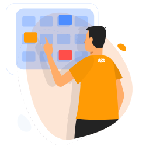
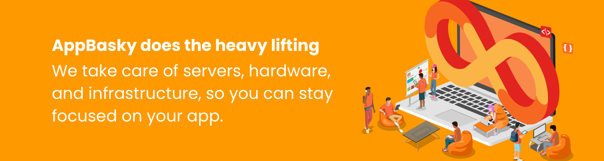

	
    
<b>The fastest way for developers to build, deploy, and scale containerized apps using Kubernetes</b>  
    
<b>Choose AppBasky and Run Kubernetes Everywhere: it’s the best platform for testing, building and deploying modern apps quickly.</b>  
	

    :star: Star us on GitHub — it helps!

## Start your Engine

<b>Self-service, on-demand application stacks.</b>  
Use the languages and tools you want. AppBasky includes pre-created container images and templates that allow you to easily build and deploy your favorite application frameworks, databases, and images to your Kubernetes clusters faster and easier than ever.

From cloud to datacenter, AppBasky lets you deliver Kubernetes-as-a-Service for your team or for your customers.

Start Your Engine! Accelerate your DevOps Performance using AppBasky.
The AppBasky DevOps Acceleration Engine is delivered on a unique, complete, and fully integrated technology framework. 
 
## Contents

- [Seamless Deployments](#seamless-deployments)
- [Turbocharge Build Process](#turbocharge-build-process)
- [Auto Scaling](#auto-scaling)
- [Familiar Languages and Tools](#familiar-languages-and-tools)
- [Maximize Productivity](#maximize-productivity)
- [Deploy for free](#deploy-for-free)
- [App Metrics](#app-metrics)
- [Contributions](#contributions)
- [License](#license)

## Seamless Deployments
The fastest way for developers to deploy, scale and manage applications with ease on a Kubernetes-based open source platform. AppBasky enables developers and engineers to stay more productive with its zero configuration deployments.   Each deployment comes with a unique, shareable URL that remains up-to-date as you work. AppBasky helps you prototype new ideas and deliver new applications to production easily.

## Turbocharge Build Process

AppBasky concurrent build feature lets you automate several builds simultaneously and faster. With every code push to Github, Bitbucket, or GitLab, we will build your project automatically. 
  
Every change to your application AppBasky creates a unique deployable release. Continuous deployment ensures updates with zero downtime. Rollback to previous release with its automatic backup and manual restore.
  
AppBasky's integration with Github, GitLab and Bitbucket means every push to git and your application will be live with zero configuration required. Every AppBasky project comes with free custom domain support and free SSL certificate. 

## Auto Scaling

AppBasky handles everything from critical production, configuration, load balancing, failovers, logging, security, and more. You don’t need to worry about the website surges and managing underlying infrastructure.   AppBasky's autoscaling feature allows your application to instantly scale up or down as needed, your don't need to worry about application performance or crashing due to platform capacity.   Engineers and developers can focus on building great applications without thinking the overhead management.  

## Development Languages
Build your applications on your way! AppBasky's flexibility gives developers the freedom of choice. 
AppBasky ensure that the latest language versions, language frameworks and other language features are patched and fully supported.

* Python
* Node
* PHP
* Ruby
* Java
* Scala
* Go
* Clojure

Build your applications with your favorite tools, languages, databases and services that work best for your application, team and business.

## Maximize Productivity
AppBasky is an open source Kubernetes-as-a-Service platform that managed container system for building, running and managing modern applications. AppBasky's tools and services are meticulously designed to support the best possible developer experience.  
  
Deploying applications on AppBasky is fast and reliable. AppBasky's team monitors the uptime, performance, and infrastructure concerns, freeing you from distraction of setting up and managing own servers and hardware operations.

## Deploy for Free

Build and deploy your applications for free. AppBasky help you experiment, play or test out new ideas with your application without paying any fee. You can deploy your free application as many times as you need to as long as it will be live and publicly accessible. 

## App Metrics

Know what’s going on with your applications with our built-in monitoring of response times, memory, CPU load, and errors. AppBasky provide a detailed overview of your application status.

## Contributions
We <a href="https://github.com/AppBasky/appbasky">welcome contributions</a>, whether you're into Python, Kubernetes, want to get started in open-source, or just have an improvement idea.
    
## License

This project is licensed under the MIT License - see the [LICENSE.md](LICENSE.md) file for details

## Acknowledgments

* Hat tip to anyone whose code was used
* Inspiration
* etc

	**Follow the <a href="https://twitter.com/appbasky">AppBasky Twitter account</a> for updates on new list additions.** 

