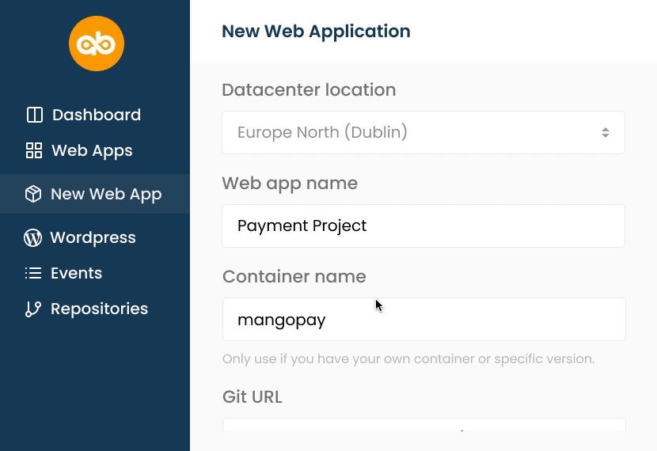
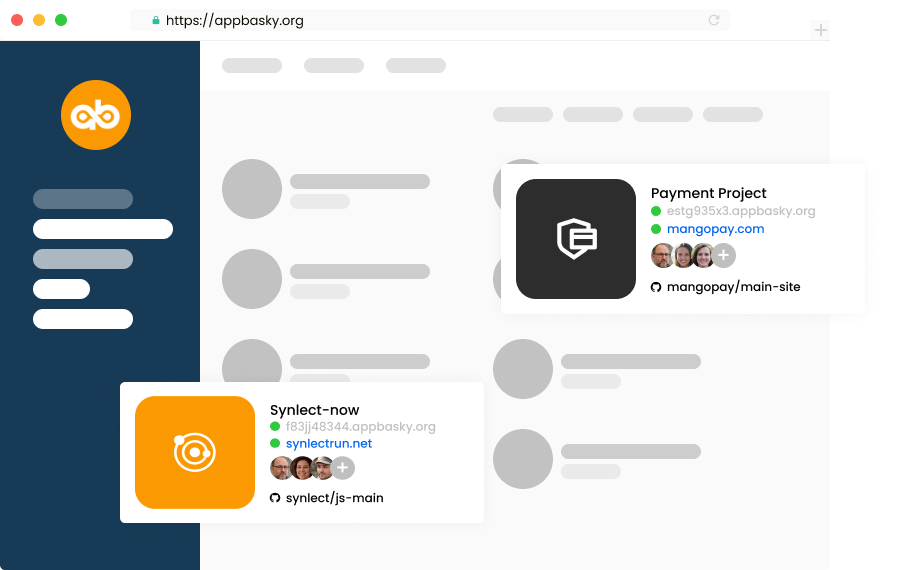
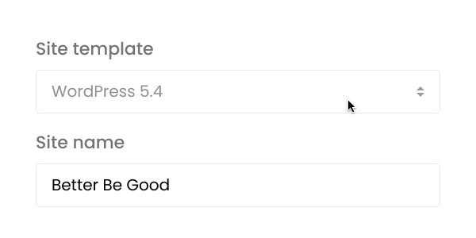
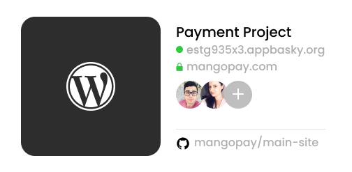

**The fastest way for developers to deploy and scale containerized apps using Kubernetes.**

---

Choose AppBasky and Run Kubernetes Everywhere: it’s the best platform for testing, building and deploying modern apps quickly.

AppBasky is 100% Open Source project
made with ❤️ by the community.

# Start your Engine

# Self-service
Use the languages and tools you want. AppBasky includes pre-created container images and templates.

From cloud to datacenter, AppBasky lets you deliver Kubernetes-as-a-Service for your team or for your customers.

Start Your Engine! Accelerate your DevOps Performance using AppBasky.
The AppBasky DevOps Acceleration Engine is delivered on a unique, complete, and fully integrated technology framework. 

# Contents
- [Instant Deployment](#instant-deployment)
- [Turbocharge your build process](#turbocharge-your-build-process)
- [Work fast and create awesome apps](#work-fast-and-create-awesome-apps)
- [WordPress hosting](#wordpress-hosting)
- [Built for designers and creative agencies](#built-for-designers-and-creative-agencies)
- [Get started with AppBasky](#get-started-with-appbasky)
- [Contributions](#contributions)
- [License](#license)

# Instant Deployment
Easy deploy and scale your favorite application frameworks, databases, and images to your Kubernetes clusters faster and easier than ever.

## Works with all familiar languages and tools
- Python
- Ruby
- Node.js
- Java
- PHP

# Turbocharge your build process
Every change to your application AppBasky creates a unique deployable release. Continuous deployment ensures updates with zero downtime. Rollback to previous release with its automatic backup and manual restore.

AppBasky's integration with Github means every push to git and your application will be live with zero configuration required. Every AppBasky comes with custom domain and SSL support.

# Work fast and create awesome apps
Focus only on building great applications without the management overhead.

## Zero Configurations
- Zero server management and zero configuration deployments.

## Seamless Re-builds
- Every change to your application creates a unique deployable release.

## Simple Management
- Easily manage deployment environments on any cloud.

## Collaborative
- Invite a team member to collaborate with the app that you are building.

# WordPress hosting
Beginner-friendly, and developer-friendly WordPress hosting.
Build, scale and manage hundreds of sites with ease.

# Built for designers and creative agencies
One place to manage your team, client sites and workflow.

## Easy to use
- Great for non-developers who want to launch a WordPress site.

## Collaboration
- Collaborate with your agency or publishing team.

## Free SSL
- Add free SSL certificate straight from your dashboard.

## Restore backups
- Built-in caching and automatic daily backups.

# Get started with AppBasky
A 100% Open Source project, check it out and give it a try.

# Contributions
We welcome [contributions](https://github.com/AppBasky/appbasky/blob/master/community/CONTRIBUTING.md), whether you're into Python, Kubernetes, want to get started in open-source, or just have an improvement idea.

# License

This project is licensed under the MIT License - see the [LICENSE.md](https://github.com/AppBasky/appbasky/blob/master/LICENSE.md) file for details

# Contact
* Slack: [Join our community](https://appbasky.slack.com/join/shared_invite/zt-drjj6h81-MgGQT9_tIcr82e_zIlKPrA#/)
* Twitter: Follow us [@appbasky](https://twitter.com/AppBasky)
* Blog: Check out our [Blog](http://appbasky.org/blog)
* Videos: [Youtube](https://www.youtube.com/channel/UCz3d2uJUlzapcv9tPeeGWew)
