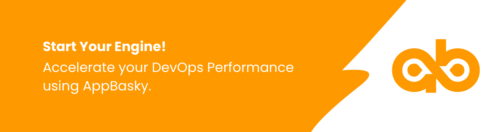

	
    
<b>The fastest way for developers to build, deploy, and scale containerized apps using Kubernetes</b>  
    
<b>Choose AppBasky and Run Kubernetes Everywhere: it’s the best platform for testing, building and deploying modern apps quickly.</b>  
	

    :star: Star us on GitHub — it helps!

## Start your Engine

<b>Self-service, on-demand application stacks.</b>  
Use the languages and tools you want. AppBasky includes pre-created container images and templates that allow you to easily build and deploy your favorite application frameworks, databases, and images to your Kubernetes clusters faster and easier than ever.

From cloud to datacenter, AppBasky lets you deliver Kubernetes-as-a-Service for your team or for your customers.

Start Your Engine! Accelerate your DevOps Performance using AppBasky.
The AppBasky DevOps Acceleration Engine is delivered on a unique, complete, and fully integrated technology framework. 
 
## Contents

- [Seamless Deployments](#seamless-deployments)
- [Scale](#scale)
- [Programming Languages](#programming-languages)
- [Integration](#integration)
- [App Metrics](#app-metrics)

## Seamless Deployments
The fastest way for developers to deploy, scale and manage applications with ease on a Kubernetes-based open source platform.   AppBasky enables developers and engineers to stay more productive with its zero configuration deployments. 

## Turbocharge Build Process

AppBasky concurrent build feature lets you automate several builds simultaneously and faster.   With every code push to Github, Bitbucket, or GitLab, we will build your project automatically.
  Every change to your application AppBasky creates a unique deployable release. Continuous deployment ensures updates with zero downtime. Rollback to previous release with its automatic backup and manual restore.

 
 

## Instant Scale

AppBasky handles everything from critical production, configuration, load balancing, failovers, logging, security, and more. You don’t need to worry about the website surges and managing underlying infrastructure. Engineers and developers can focus on building great applications without thinking about the overhead management.

## Programming Languages

Build and deploy your application using many of the popular languages like 
* Python
* C#
* PHP
* Node.js
* Java

## Integration

Our integration with Github, GitLab and Bitbucket means every push to git and your static website will be live with zero configuration required. Every AppBasky project comes with free custom domain support and free SSL certificate. 

## App Metrics

Know what’s going on with your applications with our built-in monitoring of response times, memory, CPU load, and errors.

## Contributions
We <a href="https://github.com/AppBasky/appbasky">welcome contributions</a>, whether you're into Python, Kubernetes, want to get started in open-source, or just have an improvement idea.
    
## License

This project is licensed under the MIT License - see the [LICENSE.md](LICENSE.md) file for details

## Acknowledgments

* Hat tip to anyone whose code was used
* Inspiration
* etc

	**Follow the <a href="https://twitter.com/appbasky">AppBasky Twitter account</a> for updates on new list additions.** 

